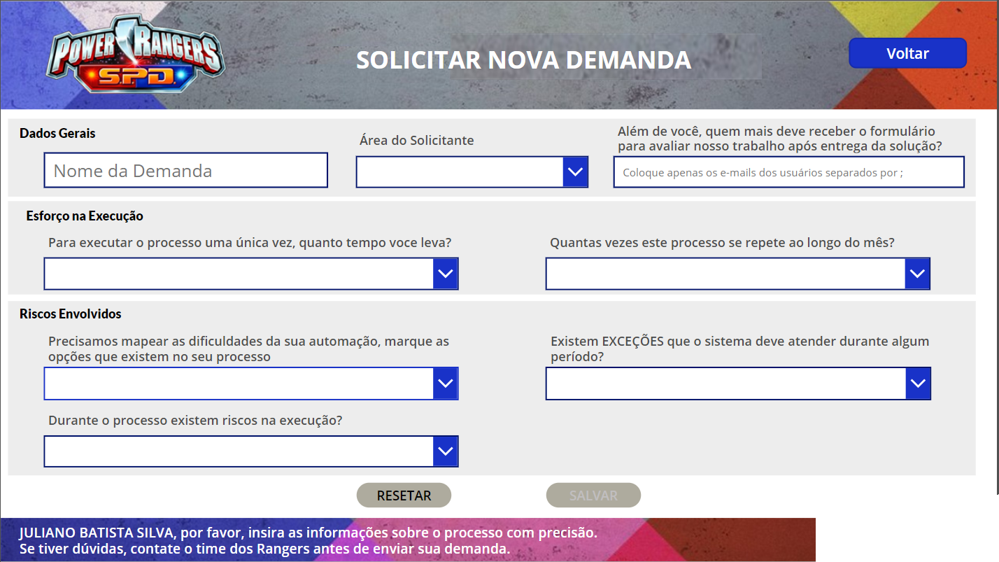
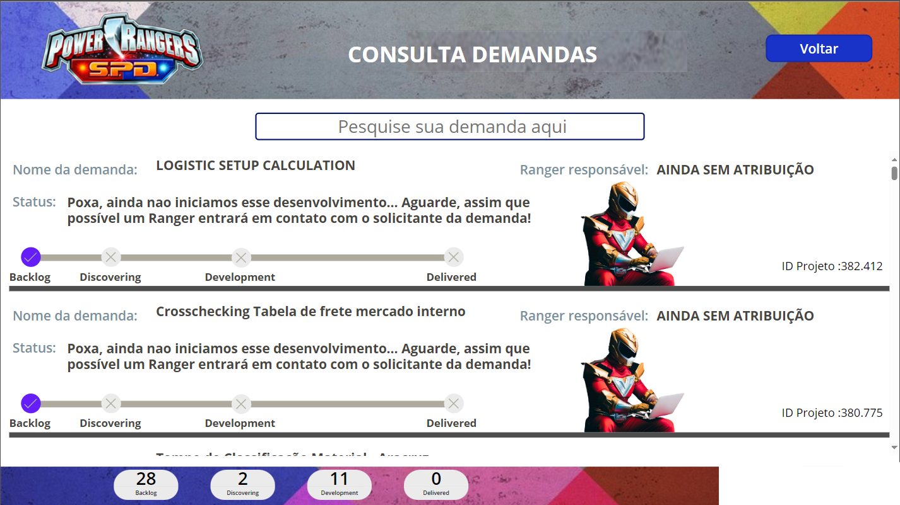

# PowerApps - Aplicativo Registro de Não Conformidades

## Visão Geral

Este aplicativo PowerApps foi projetado para atender às necessidades específicas do setor logístico, focando especialmente na equipe de recebimento. Sua responsividade permite fácil utilização em diversos dispositivos, garantindo praticidade e eficiência.

## Aviso DEV

Para integrar este modelo ao seu projeto, é crucial estabelecer uma conexão com um banco de dados, que foi removido por motivos de segurança. Atualmente, este aplicativo segue sendo utilizado por uma empresa da área logística.

## Funcionalidades Principais

1. **Responsividade:**
   - O aplicativo é desenvolvido para operar eficientemente em diferentes dispositivos, incluindo smartphones, tablets e desktops.

2. **Leitor de Código de Barras:**
   - Integra um leitor de código de barras para facilitar a identificação e rastreamento de produtos.

3. **Registro de Avarias e Não Conformidades:**
   - Permite que usuários da equipe logística no setor de recebimento registrem avarias ou não conformidades em produtos provenientes da produção.
   - Oferece campos específicos para detalhar a natureza da avaria e documentar informações relevantes.

## Como Usar

1. **Acesso:**
   - Faça login utilizando as credenciais fornecidas pela equipe de TI.

2. **Leitura de Código de Barras:**
   - Utilize a função de leitura de código de barras para escanear os códigos dos produtos recebidos.

3. **Registro de Avarias ou Não Conformidades:**
   - Complete os campos necessários para documentar avarias ou não conformidades.
   - Anexe fotos, se necessário, para fornecer uma documentação visual.

4. **Responsividade:**
   - Desfrute da experiência responsiva em diferentes dispositivos para maior flexibilidade no uso.

## Requisitos do Sistema

- Navegador da web moderno
- Dispositivo com câmera para a funcionalidade de leitura de código de barras (em dispositivos móveis)

## Capturas de Tela
>Home Page

>Solicitações

>Consultas
